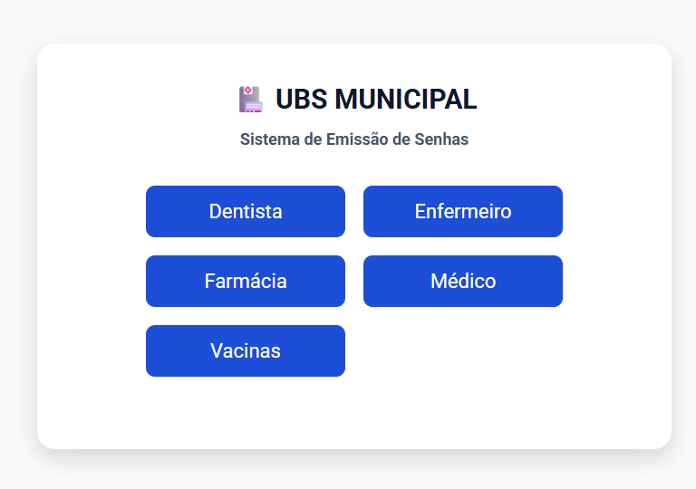
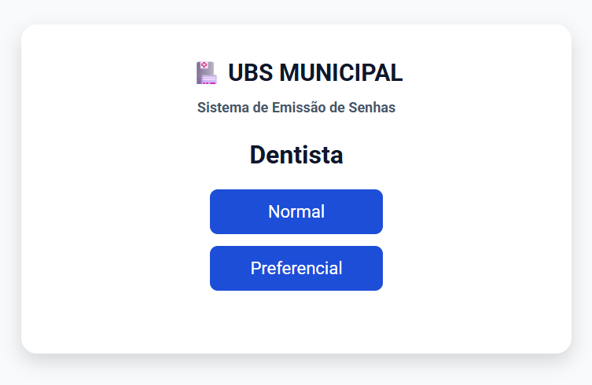
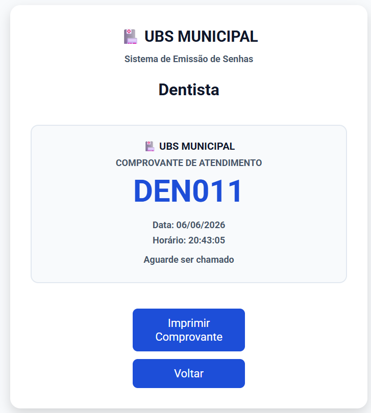
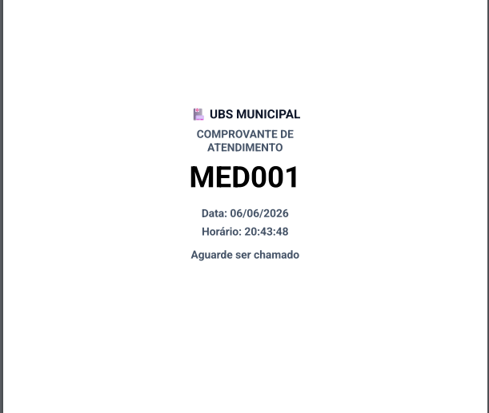

# 🏥 Sistema de Senhas para Clínica / UBS

Sistema web desenvolvido para gerenciamento de filas de atendimento em Clínicas e Unidades Básicas de Saúde (UBS), permitindo a emissão de senhas normais e preferenciais por setor de atendimento.

## 📋 Sobre o Projeto

O objetivo deste projeto é simular um sistema real de gerenciamento de filas utilizado em clínicas e unidades de saúde.

O sistema permite gerar senhas para diferentes setores, emitir senhas preferenciais, imprimir comprovantes e manter os contadores salvos mesmo após atualizar ou fechar a página.

## 🚀 Funcionalidades

* ✅ Emissão de senhas normais
* ✅ Emissão de senhas preferenciais
* ✅ Controle por setor de atendimento
* ✅ Impressão de comprovantes
* ✅ Persistência de dados com Local Storage
* ✅ Continuidade da numeração após atualizar a página
* ✅ Reinicialização automática dos contadores diariamente
* ✅ Interface responsiva para desktop e dispositivos móveis

## 🏥 Setores Disponíveis

* 🦷 Dentista (DEN)
* 👩‍⚕️ Enfermagem (ENF)
* 💊 Farmácia (FAR)
* 🩺 Médico (MED)
* 💉 Vacinação (VAC)

## 📸 Demonstração

### Tela Inicial

<p>
  
</p>

### Seleção de Atendimento

<p>
  
</p>

### Senha Gerada

<p>
  
</p>

### Comprovante para Impressão

<p>
  
</p>

## 🛠️ Tecnologias Utilizadas

* HTML5
* CSS3
* JavaScript
* Local Storage
* Git
* GitHub

## 📂 Estrutura do Projeto

```text
src/
├── css/
│   ├── style.css
│   ├── responsivo.css
│   └── print.css
│
├── js/
│   └── index.js
│
└── img/
```

## 💡 Conceitos Aplicados

Durante o desenvolvimento deste projeto foram praticados conceitos importantes de desenvolvimento Front-end:

* Manipulação do DOM
* Organização de funções JavaScript
* Objetos e propriedades
* Persistência de dados
* JSON.stringify()
* JSON.parse()
* Local Storage
* Responsividade
* Controle de estado da aplicação
* Impressão via navegador

## 🔄 Próximas Implementações

* 📊 Dashboard administrativo
* 📜 Histórico de senhas emitidas
* 🔐 Área administrativa protegida por senha
* 📢 Painel de chamada de senhas
* 🔊 Som de chamada
* 🌐 Backend com Node.js
* 🗄️ Banco de dados
